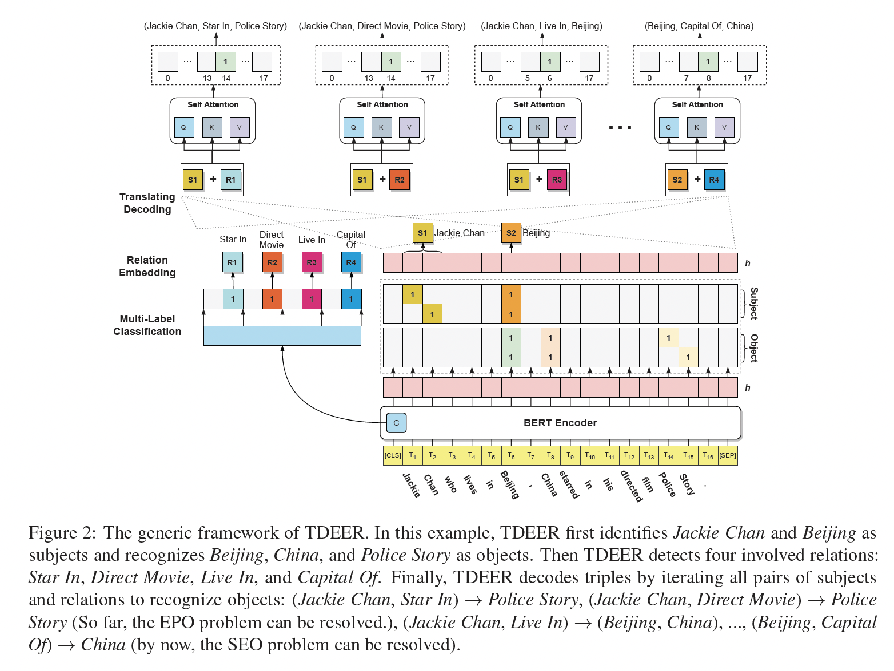
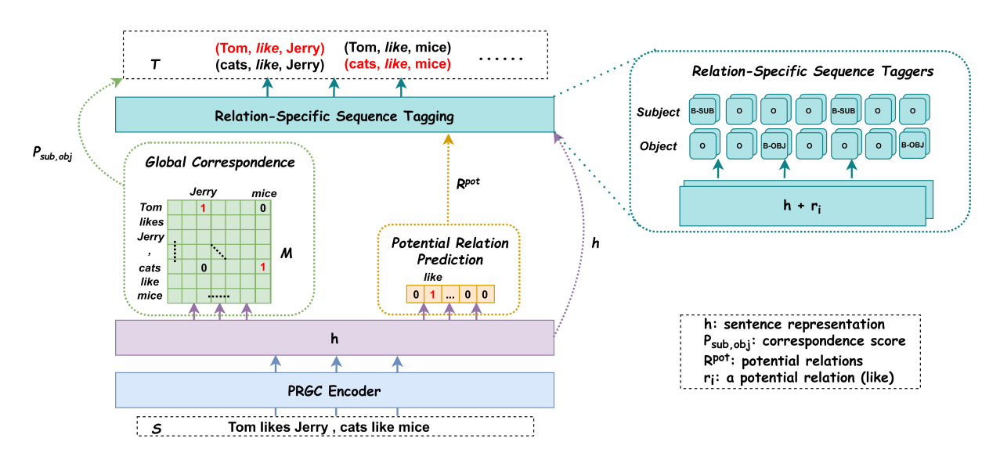
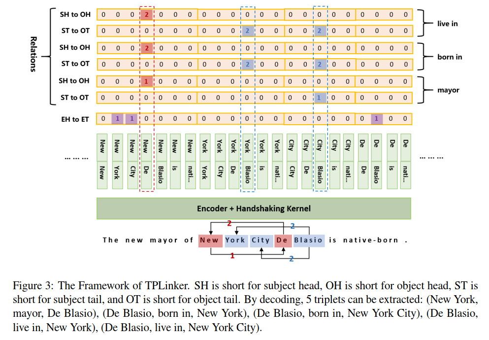
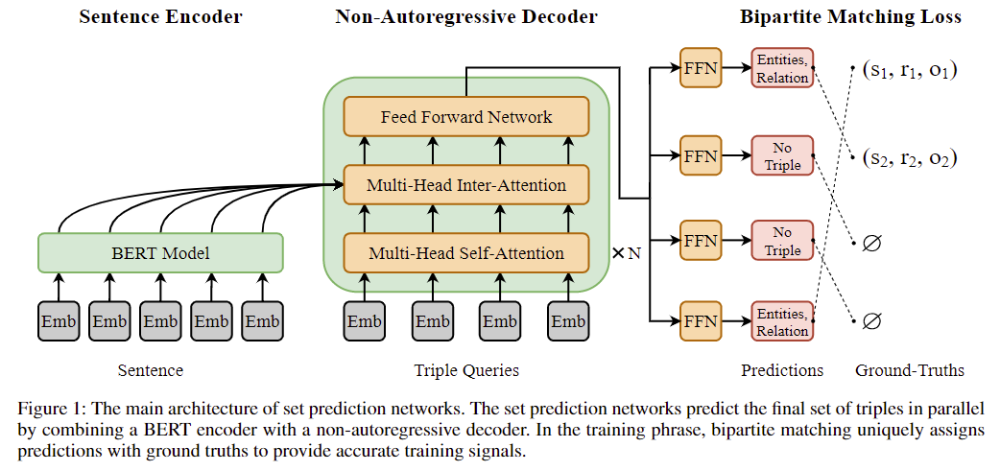
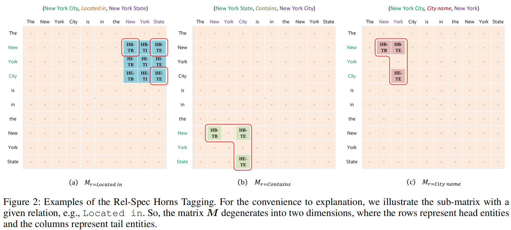
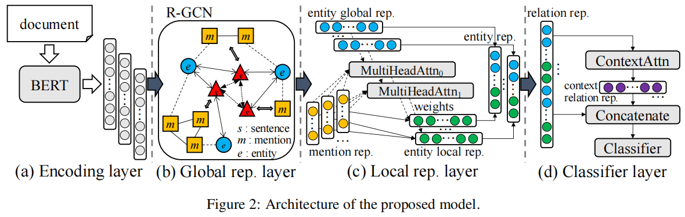

# TDEER 🦌

Official Paper For [TDEER: An Efficient Translating Decoding Schema for Joint Extraction of Entities and Relations](https://aclanthology.org/2021.emnlp-main.635/)
Official code For [github](https://github.com/4AI/TDEER)

## Overview

TDEER 是一种用于联合提取实体和关系的有效模型。 与预测主客体关系的常见解码方法不同，我们采用提出的翻译解码模式：subject + relation -> objects 来解码三元组。 通过提出的翻译解码模式，TDEER 可以有效地处理重叠三元组问题。



参数量：113 M

# PRGC 🦌

Official Paper For [PRGC: Potential Relation and Global Correspondence Based Joint Relational Triple Extraction](https://arxiv.org/abs/2106.09895)
Official code For [github](https://github.com/hy-struggle/PRGC)

## Overview

采用3阶段联合学习的方式抽取关系，即先预测句子中存在哪些潜在的关系，分别对预测出在关系embedding矩阵中获取相关的关系表征加在token表征中，用两个分类头分别预测该关系下有哪些subject和object(采用BIO的标注方式)，最后学习subject和object对齐的矩阵(所有关系的subject和object对都在这个矩阵中表示出来)。



参数量：113 M

# TPLinker 🦌

Official Paper For [TPLinker: Single-stage Joint Extraction of Entities and Relations Through Token Pair Linking](https://arxiv.org/abs/2010.13415)
Official code For [github](https://github.com/131250208/TPlinker-joint-extraction)

## Overview

采用一阶段联合学习的方式抽取关系。对于N个关系，采用2N+1个头进行预测，即其中一个通过下标的方式预测实体的头尾，2N个头分别是N个预测subject-to-object头部(SH-to-OH)和subject-to-object尾部(ST-to-OT)是否存在关系。最后通过一定规则解码，得出所有关系对。



参数量：116 M

# SPN4RE 🦌

Official Paper For [SPN4RE:Joint Entity and Relation Extraction with Set Prediction Networks](https://arxiv.org/abs/2011.01675)
Official code For [github](https://github.com/DianboWork/SPN4RE)

## Overview

采用集合预测方式，预先定义最大的预测triple数量m，然后对这m个将要预测的triple采用query形式，生成embedding，与token表征进行cross attention交互，预测句子中的关系类型，以及subject和object的start和end索引。最后采用Bipartite Matching Loss，即使用匈牙利算法先得到ground truth triple和预测的triple之间最佳匹配(cost最小)，然后基于最佳匹配计算损失。
个人认为，本文的核心创新点就是利用将triples当作一个集合去预测，并使用Bipartite Matching Loss作为模型的训练的对象。



参数量：142 M

# OneRel 🦌

该模型没有源码，这是根据论文复现出来的。但是其中还有很多疑惑之处。比如，如何让模型实现row(行)一定表示subject(head)，让columns(列)表示object(tail)呢？
Official Paper For [OneRel: Joint Entity and Relation Extraction with One Module in One Step](https://arxiv.org/abs/2203.05412)
NO Official code For [github](https://github.com/ssnvxia/OneRel)

## Overview

采用一步学习一个M矩阵(K x 4 x L x L)，L是文本长度，K是关系数量，4表示4种标记，HB-TB，HB-TE，HE-TE，-这4种关系，其借鉴了知识图谱嵌入HOLE的思想，设计其pair对的学习对象。



参数量：113 M

使用的数据格式:

```
{
"text": "Mr. Ferrer still holds commanding leads over the other two Democrats in the race -- United States Representative Anthony D. Weiner of Brooklyn and Queens , and City Council Speaker Gifford Miller -- and is also ahead of Mayor Michael R. Bloomberg in most polls .",
"triple_list": [[
    "Weiner",
    "/people/person/place_lived",
    "Queens"
    ],[
    "Weiner",
    "/people/person/place_lived",
    "Brooklyn"
    ]]
}
```

# GLRE 🦌

Official Paper For [Global-to-Local Neural Networks for Document-Level Relation Extraction](https://arxiv.org/abs/2203.05412)
Official code For [github](https://github.com/nju-websoft/GLRE)

## Overview

文档级别的关系抽取。本文通过编码层编码文档信息；全局表征层将文档中的句子、mention、实体等构建层一个异构图，并使用R-GCN来提取实体的全局表征；局部表征层利用多头注意力机制将实体全局表征作为Query、句子节点表征作为Key，mention节点表征作为Value，最终提取实体的局部表征；最后的分类层，聚合了所有的实体对以提取文档的主题信息表征，并与实体对的target关系表征进行结合，预测该实体对的关系。
根据其源码，其对整个文档是作为一个句子输入到bert的tokenizer中，并没有对每个句子单独解析出其token。其实现有点伪文档关系抽取的味道？
ps: ``这是一篇文档级关系抽取算法，说是文档级，但是却把一篇文档不做任何处理，进行拼接输入到预训练模型中，如果超过预训练模型的长度限制，就进行截断。这与句子级关系抽取有何区别？就是多了几个句子而已？``



参数量：113 M
数据格式:

```
{"vertexSet": [
    [{"name": "Lark Force", "pos": [0, 2], "sent_id": 0, "type": "ORG"},{"sent_id": 3, "type": "ORG", "pos": [2, 4], "name": "Lark Force"},{"name": "Lark Force", "pos": [3, 5], "sent_id": 4, "type": "ORG"}], 
    [{"name": "Australian Army", "pos": [4, 6], "sent_id": 0, "type": "ORG"}], 
    [{"pos": [9, 11], "type": "TIME", "sent_id": 0, "name": "March 1941"}], 
    [{"name": "World War II", "pos": [12, 15], "sent_id": 0, "type": "MISC"}], 
    [{"name": "New Britain", "pos": [18, 20], "sent_id": 0, "type": "LOC"}], 
    [{"name": "New Ireland", "pos": [21, 23], "sent_id": 0, "type": "LOC"}], 
    [{"name": "John Scanlan", "pos": [6, 8], "sent_id": 1, "type": "PER"}], 
    [{"name": "Australia", "pos": [13, 14], "sent_id": 1, "type": "LOC"}], 
    [{"name": "Rabaul", "pos": [17, 18], "sent_id": 1, "type": "LOC"},{"name": "Rabaul", "pos": [12, 13], "sent_id": 3, "type": "LOC"}], 
    [{"name": "Kavieng", "pos": [19, 20], "sent_id": 1, "type": "LOC"},{"name": "Kavieng", "pos": [14, 15], "sent_id": 3, "type": "LOC"}], 
    [{"pos": [22, 24], "type": "MISC", "sent_id": 1, "name": "SS Katoomba"}], 
    [{"pos": [25, 27], "type": "MISC", "sent_id": 1, "name": "MV Neptuna"}], 
    [{"name": "HMAT Zealandia", "pos": [28, 30], "sent_id": 1, "type": "MISC"}], 
    [{"name": "Imperial Japanese Army", "pos": [8, 11], "sent_id": 3, "type": "ORG"}], 
    [{"pos": [18, 20], "type": "TIME", "sent_id": 3, "name": "January 1942"}], 
    [{"name": "Japan", "pos": [8, 9], "sent_id": 4, "type": "LOC"}], 
    [{"pos": [12, 13], "type": "MISC", "sent_id": 4, "name": "NCOs"}], 
    [{"name": "USS Sturgeon", "pos": [20, 22], "sent_id": 4, "type": "MISC"}], 
    [{"sent_id": 4, "type": "MISC", "pos": [27, 29], "name": "Montevideo Maru"}], 
    [{"name": "Japanese", "pos": [5, 6], "sent_id": 5, "type": "LOC"}], 
    [{"pos": [15, 16], "type": "NUM", "sent_id": 5, "name": "1,050"}], 
    [{"pos": [17, 18], "type": "NUM", "sent_id": 5, "name": "1,053"}]
    ], 
"labels": [
    {"r": "P607", "h": 1, "t": 3, "evidence": [0]}, 
    {"r": "P17", "h": 1, "t": 7, "evidence": [0, 1]}, 
    {"r": "P241", "h": 6, "t": 1, "evidence": [0, 1]}, 
    {"r": "P607", "h": 6, "t": 3, "evidence": [0, 1]}, 
    {"r": "P27", "h": 6, "t": 7, "evidence": [0, 1]}, 
    {"r": "P1344", "h": 7, "t": 3, "evidence": [0, 1]}, 
    {"r": "P607", "h": 13, "t": 3, "evidence": [0, 3]}, 
    {"r": "P17", "h": 13, "t": 15, "evidence": [3, 4, 5]}, 
    {"r": "P17", "h": 13, "t": 19, "evidence": [3, 4, 5]}, 
    {"r": "P1344", "h": 15, "t": 3, "evidence": [0, 3, 4, 5]}, 
    {"r": "P172", "h": 15, "t": 19, "evidence": [4, 5]}, 
    {"r": "P607", "h": 17, "t": 3, "evidence": [0, 4]}, 
    {"r": "P17", "h": 11, "t": 7, "evidence": [1]}, 
    {"r": "P17", "h": 12, "t": 7, "evidence": [0, 1]}, 
    {"r": "P137", "h": 0, "t": 1, "evidence": [0, 1]}, 
    {"r": "P571", "h": 0, "t": 2, "evidence": [0]}, 
    {"r": "P607", "h": 0, "t": 3, "evidence": [0]}, 
    {"r": "P17", "h": 0, "t": 7, "evidence": [0, 1]}
    ], 
"title": "Lark Force", 
"sents": [
    ["Lark", "Force", "was", "an", "Australian", "Army", "formation", "established", "in", "March", "1941", "during", "World", "War", "II", "for", "service", "in", "New", "Britain", "and", "New", "Ireland", "."], 
    ["Under", "the", "command", "of", "Lieutenant", "Colonel", "John", "Scanlan", ",", "it", "was", "raised", "in", "Australia", "and", "deployed", "to", "Rabaul", "and", "Kavieng", ",", "aboard", "SS", "Katoomba", ",", "MV", "Neptuna", "and", "HMAT", "Zealandia", ",", "to", "defend", "their", "strategically", "important", "harbours", "and", "airfields", "."], 
    ["The", "objective", "of", "the", "force", ",", "was", "to", "maintain", "a", "forward", "air", "observation", "line", "as", "long", "as", "possible", "and", "to", "make", "the", "enemy", "fight", "for", "this", "line", "rather", "than", "abandon", "it", "at", "the", "first", "threat", "as", "the", "force", "was", "considered", "too", "small", "to", "withstand", "any", "invasion", "."], 
    ["Most", "of", "Lark", "Force", "was", "captured", "by", "the", "Imperial", "Japanese", "Army", "after", "Rabaul", "and", "Kavieng", "were", "captured", "in", "January", "1942", "."], 
    ["The", "officers", "of", "Lark", "Force", "were", "transported", "to", "Japan", ",", "however", "the", "NCOs", "and", "men", "were", "unfortunately", "torpedoed", "by", "the", "USS", "Sturgeon", "while", "being", "transported", "aboard", "the", "Montevideo", "Maru", "."], 
    ["Only", "a", "handful", "of", "the", "Japanese", "crew", "were", "rescued", ",", "with", "none", "of", "the", "between", "1,050", "and", "1,053", "prisoners", "aboard", "surviving", "as", "they", "were", "still", "locked", "below", "deck", "."]
    ]
}
```

# PLMarker🦌


# 项目说明

本项目主要是在NYT句子集关系抽取数据集和DocRED篇章级关系抽取数据进行相关模型的实验。相应的数据下载后解压到data文件夹中。
